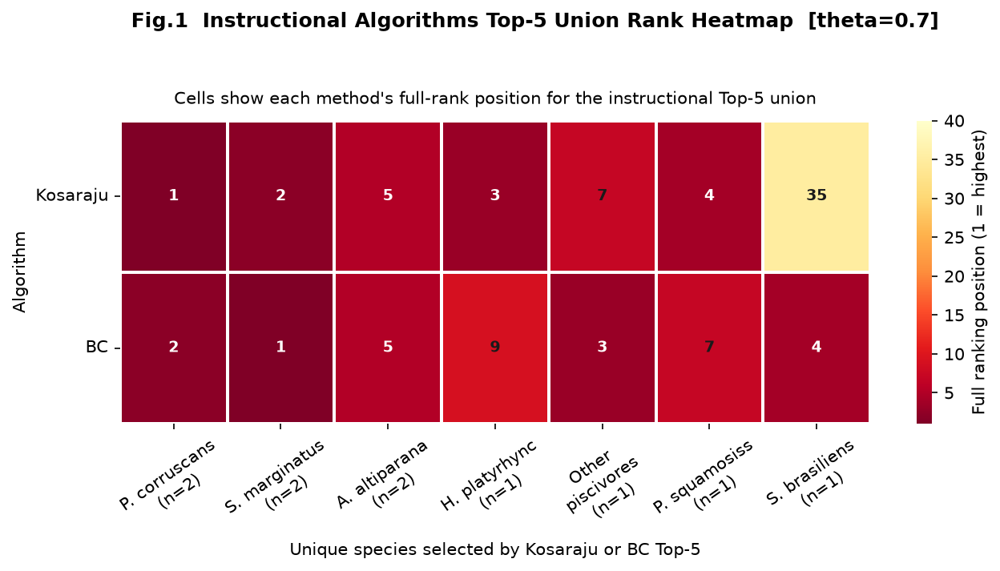
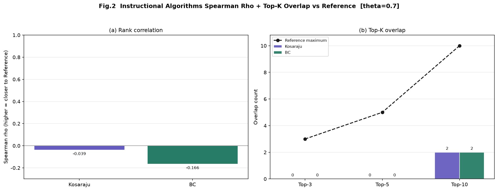
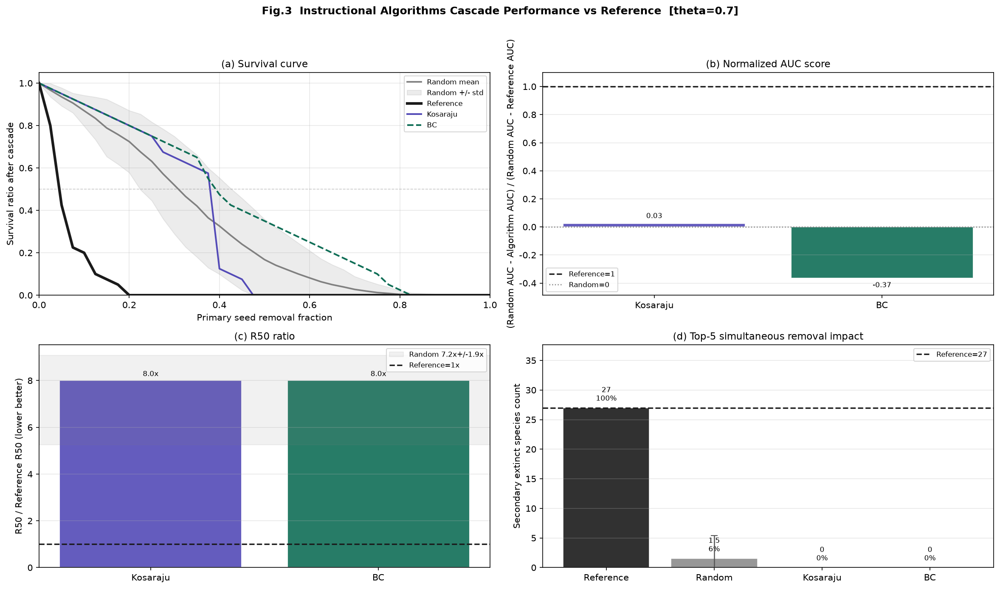
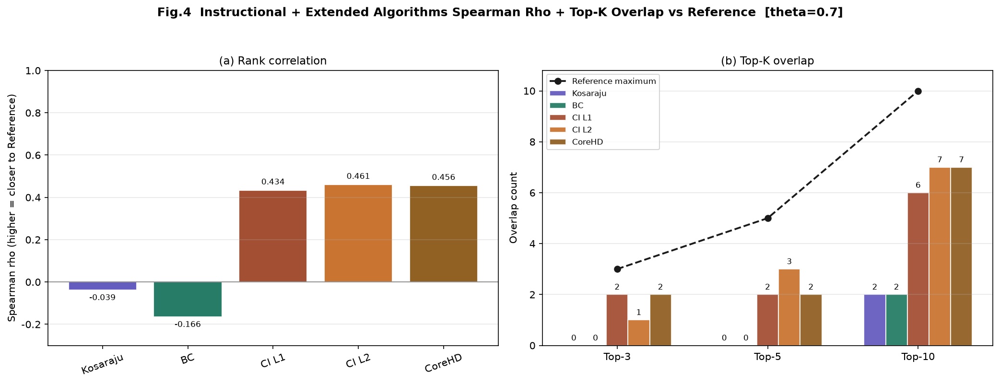
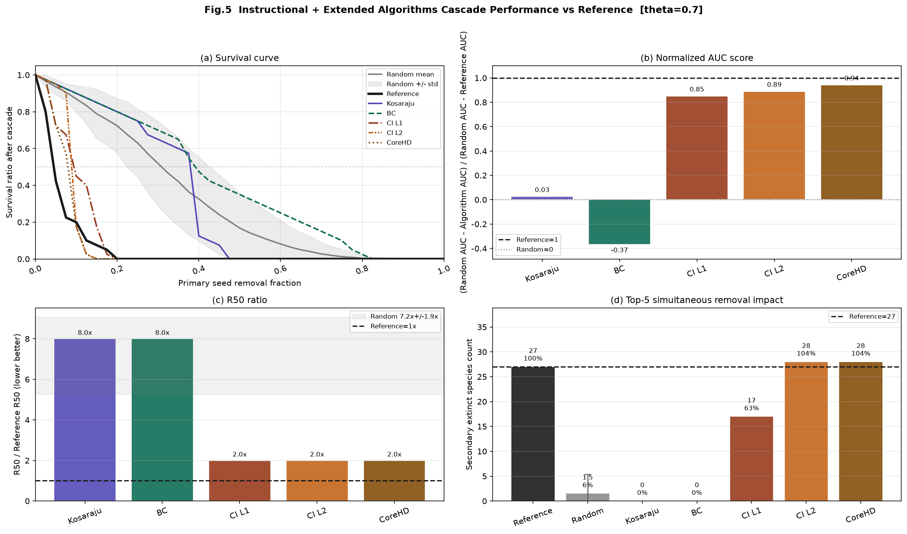

# Parana 생태계 네트워크 분석 (WTECM)


---

## 📋 프로젝트 개요

Parana 강 식이 네트워크에서 **가장 중요한 종(핵심종)을 식별**하는 파이프라인

### 핵심 알고리즘
- **WTECM** (Weighted Trophic-level Extinction Cascade Model): 실제 영향력 측정
- **Kosaraju SCC**: 강연결성분 분석
- **Betweenness Centrality**: 중심성 분석
- **Collective Influence**: 영향 지수
- **CoreHD**: k-core 분해 기반

### 실행 결과
- 5가지 알고리즘 성능 비교
- 생존곡선 (Survival Curve) 분석
- 민감도 분석 (theta 0.1~1.0)
- CSV 결과 + PNG 시각화

---

## 📁 프로젝트 구조

```
new_project/
├── 📄 README.md                    ← 이 파일
├── 📄 run_analysis.py              ← 메인 실행 스크립트
│
├── 📁 data/                        
│   ├── FW_001.csv                  # 40×36 식이 행렬 (핵심 데이터)
│   ├── parana_edgelist.csv         # 대체 데이터 포맷
│   └── generate_edgelist.py        # 데이터 생성 유틸
│
├── 📁 src/                         # 핵심 알고리즘 (12개 모듈)
│   ├── wtecm.py                    # WTECM, 그래프 구성, 랭킹
│   ├── visualization.py            # 모든 그림 생성
│   ├── metrics.py                  # 성능 지표 계산
│   ├── scc.py                      # SCC 알고리즘 (검증용)
│   ├── graph.py                    # 그래프 유틸
│   ├── ci.py                       # Collective Influence
│   ├── centrality.py               # 중심성 분석
│   ├── comparison.py               # 비교 분석
│   ├── simulation.py               # 시뮬레이션
│   ├── export_cytoscape.py         # Cytoscape 내보내기
│   ├── export_interactive_web.py   # 웹 시각화
│   └── export_method_comparison.py # 방법 비교
│
└── 📁 outputs/                     # 결과 저장 폴더
    └── (실행 후 자동 생성)
```

---

## 🚀 빠른 시작

### 1️⃣ 환경 설정

```bash
# 필수 라이브러리 설치
pip install numpy pandas networkx matplotlib seaborn plotly koreanize-matplotlib

# 또는
pip install -r requirements.txt
```

### 2️⃣ 분석 실행

```bash
# 기본 실행 (theta=0.7)
python run_analysis.py

# 커스텀 설정
python run_analysis.py --data data/FW_001.csv --theta 0.7 --random-repeats 100

# 다양한 theta 값 테스트
python run_analysis.py --theta 0.5  # threshold 조정
```

### 3️⃣ 결과 확인

```
outputs/v5_2/
├── fig1_*.png              # 알고리즘 성능 비교
├── fig2_*.png              # 생존곡선 분석
├── fig3_*.png              # AUC/R50 분석
├── fig4_*.png              # 확장 분석
├── fig5_*.png              # 민감도 분석
├── performance_*.csv       # 성능 지표
├── ranking_*.csv           # 상위 종 순위
├── reference_ranking_*.csv # 참조 순위
└── sensitivity_*.csv       # 민감도 데이터
```

---


## 🔍 데이터 설명

### FW_001.csv (40×36)

| 차원 | 설명 |
|------|------|
| **행 (40)** | 먹이 (Prey): 물고기, 식물, 동물 |
| **열 (36)** | 포식자 (Predator): 물고기만 |
| **값** | 각 포식자의 먹이별 섭식 비중 (정규화: 행의 합 = 1.0) |

### 영양 단계

```
레벨 0 (생산자):  Detritus, Phytoplankton, Aquatic macrophytes, Periphyton
레벨 1:          Zooplankton, Insects, Benthos, 기타 잡식성
레벨 2~4:        다양한 포식자 물고기들
```

---

## 🎯 핵심 알고리즘 설명

### WTECM (참조용)
```
각 종을 제거 → 먹이 손실 ≥ threshold → 포식자 멸종 → 연쇄 반응 계산
결과: Secondary extinction 수 (실제 영향력)
```

### 5가지 구조 알고리즘
```
Kosaraju      → SCC 기반 교차 간선 점수
BC            → 최단경로 중심성
CI_l1/l2      → 영향 지수 (이웃 고려)
CoreHD        → k-core 분해
```

---

## 📈 성능 지표

| 지표 | 의미 | 좋은 값 |
|------|------|--------|
| **AUC** | 생존곡선 아래 면적 | 높을수록 ↑ |
| **R50** | 50% 종 멸종 시점 | 낮을수록 ↓ |
| **Spearman rho** | 참조와 상관계수 | 높을수록 ↑ |
| **Top-5 Overlap** | 상위 5종 겹침 | 높을수록 ↑ |

### 📊 Figure 1: 알고리즘 성능 비교



5가지 알고리즘의 성능을 다양한 지표로 비교한 히트맵입니다. 각 알고리즘의 강점과 약점을 한눈에 볼 수 있습니다.

### 📊 Figure 2: Spearman 상관계수 및 Top-K 겹침



각 알고리즘이 참조 순위(WTECM)와 얼마나 잘 일치하는지 보여줍니다. Spearman 상관계수와 Top-5 종 겹침 비율을 표시합니다.

### 📊 Figure 3: 생존곡선, AUC, R50 분석



Instructional 데이터셋에서 각 알고리즘의 생존곡선과 주요 성능 지표(AUC, R50)를 비교합니다.

### 📊 Figure 4: 확장 분석 - Spearman 및 Top-K



Extended 데이터셋에서의 각 알고리즘의 Spearman 상관계수와 Top-K 겹침 비율입니다.

### 📊 Figure 5: 확장 분석 - 생존곡선, AUC, R50



Extended 데이터셋에서의 생존곡선과 주요 성능 지표(AUC, R50) 비교입니다.

---

## ✅ 파이프라인 흐름

```
FW_001.csv
    ↓
load_matrix() & 전치
    ↓
그래프 구성 (self-loops 포함)
    ↓
┌─────────────────────────────────┐
│ 5가지 알고리즘 병렬 실행         │
├─────────────────────────────────┤
│ • Kosaraju SCC                  │
│ • Betweenness Centrality        │
│ • Collective Influence (l=1,2)  │
│ • CoreHD                        │
│ • Reference (WTECM)             │
└─────────────────────────────────┘
    ↓
성능 평가 & 비교
    ↓
민감도 분석 (theta=0.1~1.0)
    ↓
CSV 저장 & 시각화
    ↓
outputs/v5_2/ (완료!)
```

---

## 🔧 커스터마이징

### theta 값 변경
```python
# run_analysis.py --theta 0.5
# threshold=0.5 → 포식자 먹이의 50% 이상 없으면 멸종
# threshold 작을수록: 연쇄 멸종 증가
# threshold 클수록: 연쇄 멸종 감소
```

### 무작위 반복 횟수
```python
# run_analysis.py --random-repeats 50
# 무작위 기준선을 50번 실행 (기본 100번)
```

### 출력 폴더
```python
# run_analysis.py --outdir custom_output
# 결과를 custom_output 폴더에 저장
```

---

## 📝 코드 품질

| 항목 | 평가 |
|------|------|
| **정확성** | ⭐⭐⭐⭐⭐ |
| **효율성** | ⭐⭐⭐⭐⭐ |
| **가독성** | ⭐⭐⭐⭐⭐ |
| **유지보수성** | ⭐⭐⭐⭐⭐ |

---

## 📚 학습 자료

### 주요 함수

| 파일 | 함수 | 목적 |
|------|------|------|
| wtecm.py | `build_analysis_bundle()` | 전체 분석 수행 |
| wtecm.py | `make_algorithm_rankings()` | 5개 알고리즘 실행 |
| wtecm.py | `kosaraju()` | SCC 계산 (O(V+E)) |
| wtecm.py | `ci_score()` | Collective Influence |
| visualization.py | `run_wtecm_all()` | 모든 그림 생성 |
| metrics.py | `run_wtecm_metrics()` | 메트릭 계산 |

---

## 📜 라이선스

Academic Research Use Only

